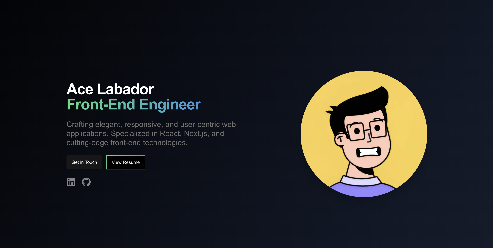

# 🌐 Alas' Personal Portfolio version 2

Welcome to the repository of **Alas' Personal Portfolio version 2** – a sleek, dynamic, and fully responsive showcase of my journey in web development. This portfolio is meticulously crafted to reflect my skills, projects, and professional growth in the ever-evolving world of technology.

 
*Preview of the portfolio landing page*

## 🌐 Deployment

This project is continuously deployed using Vercel. Every push to the main branch triggers a build and deploys the latest version of the site.

🔗 **Live Site**: [acelabador.vercel.app](https://acelabador.vercel.app)

## 🚀 Tech Stack

- **Next.js**: Core of the interactive UI
- **Tailwind CSS**: Utility-first CSS framework for rapid UI development
- **shadcn/ui**: High-quality, customizable React components
- **Vercel**: Continuous integration and deployment

## 📁 Project Structure

```
/pages
    /components   # Section components
    /home
    /about
    /projects
/public           # Public assets and sitemap
    /images       # Images used
```

## 🛠 Features

- **Responsive Design**: Fluidly adjusts to any screen size, ensuring a seamless experience from smartphones to large desktop monitors
- **SEO Optimized**: Metadata and structured data for better indexing
- **Animated Components**: Incorporates subtle yet engaging transitions and hover effects, enhancing user interaction and visual appeal
- **Project Showcase**: Showcases a carefully curated selection of personal and professional projects, highlighting my diverse skill set and problem-solving abilities
- **Resume Button**: Features a prominent resume button, allowing visitors to instantly view and download my professional credentials
- **Certificates Section**: Dedicated section within the about page that elegantly displays my certificates and accomplishments, underlining my commitment to continuous learning

## 🔧 Development

### Clone the Repository

```bash
git clone https://github.com/Alas-3/alas.dev.git
cd alas-dev
```

### Install Dependencies

```bash
npm install
```

### Run the Development Server

```bash
npm start
```

### Build for Production

```bash
npm run build
```

## 🤝 Contributing

Contributions, issues, and feature requests are welcome! Feel free to check the [issues page](https://github.com/Alas-3/alas-dev-v2/issues).

## 📄 License

This project is licensed under the MIT License – see the [LICENSE](https://opensource.org/license/mit) for details.


Enjoy browsing! 🌟 Feel free to reach out if you have any questions or suggestions.